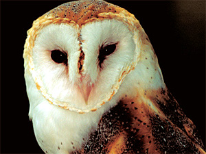

# Spirit Animals
Author: Gary Motz

My spirit animal is a white owl.

# Facts about my spirit animal
- The color of the animal connotes additional significance in Hawaiian culture.
- An owl is a wise animal. Owls are also often silent observers and signal change or death.
- Information about owls and spirit animals [here](http://www.spiritanimal.info/owl-spirit-animal/).

# Working?
- I think I'm beginning to get the hang of this.